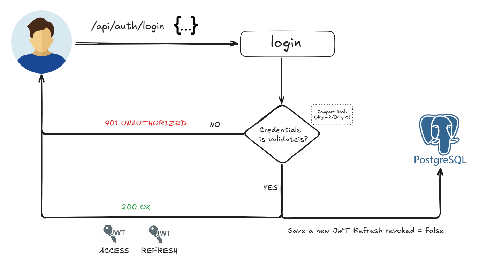
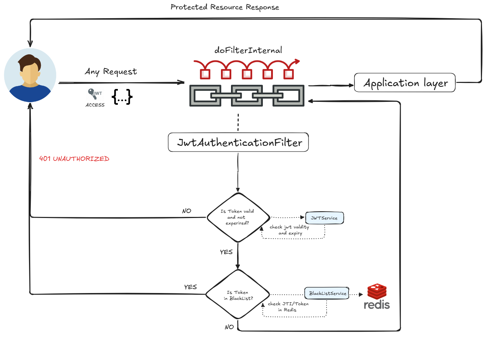
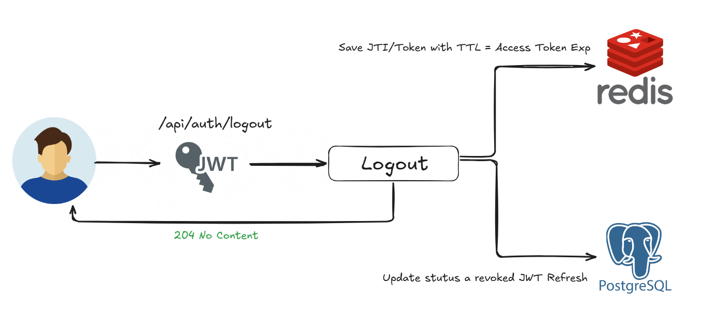

# TodoSafe – Secure JWT Architecture


**TodoSafe** is a reference implementation of a task management system focused on secure JWT authentication in distributed systems.

Beyond a conventional ToDo application, this project acts as a proof-of-concept for the "Stateless vs Secure" dilemma, implementing a **Hybrid JWT Invalidation Strategy** and a robust **Edge Layer** using NGINX.

The infrastructure is fortified with a **Reverse Proxy Architecture** that provides:
- **Unified Entry Point:** Single port exposure (80) via NGINX Gateway.
- **Attack Surface Reduction:** Backend and Database are isolated in an internal network.
- **Rate Limiting:** Protection against brute-force attacks on sensitive endpoints.
- **Static Content Delivery:** High-performance serving of the React frontend.

---

## Architecture Overview

The system follows a Layered Architecture with strict separation of concerns, orchestrated via Docker Compose.

### Infrastructure Diagram


#### Main Layers:

- Edge Layer (NGINX): Handles routing, static files, and initial security filtering.

- Client Layer (React): Consumed via NGINX, operating as a SPA.

- Application Layer (Spring Boot): RESTful API with stateless security.

- Persistence Layer: PostgreSQL (Data) and Redis (Token Blacklist).

---

### Authentication & Authorization Design



- User credentials are validated against securely hashed records (Bcrypt / Argon2) stored in PostgreSQL.
- Upon successful authentication, two tokens are issued:
  - Access Token (short-lived)
  - Refresh Token (long-lived)

This approach minimizes attack surface while maintaining usability.

---

### Request Authorization Chain (Security Filter Chain)



Authorization is implemented using a high-performance validation pipeline based on the Chain of Responsibility pattern.

A custom `OncePerRequestFilter` is integrated into the Spring Security filter chain:

1. **JWT Validation**  
   Token structure and cryptographic signature are validated.

2. **Blacklist Verification (Redis)**  
   The token JTI is checked against a Redis-backed blacklist to ensure it has not been revoked.

3. **Security Context Population**  
   If the token is valid, user identity and roles are loaded into `SecurityContextHolder`, enabling Role-Based Access Control (RBAC).

---

### Secure Logout (Hybrid Invalidation Strategy)



JWTs are stateless by design, but secure logout requires controlled state.  
TodoSafe implements a hybrid invalidation strategy to guarantee immediate session termination:

- **Redis (Fast Invalidation)**  
  The JTI of the active access token is stored in Redis with a TTL equal to the remaining token lifetime, preventing replay attacks across all replicas.

- **PostgreSQL (Persistent Revocation)**  
  The refresh token is marked as `revoked = true`, preventing further access token generation.

---

## Technology Stack

### Infrastructure & DevOps
- Gateway: NGINX (Reverse Proxy & Static Server)
- Containerization: Docker & Docker Compose (Multi-stage builds)
- Orchestration: Docker Compose (Dev/Prod overrides)
 
### Backend
- Language: Java 25
- Framework: Spring Boot
- Database: PostgreSQL
- Cache: Redis
- Build Tool: Maven

### Frontend
- Framework: React
- HTTP Client: Axios

### Infrastructure
- Containerization: Docker
- Orchestration: Docker Compose

---

## Key Features

- Gateway Pattern: Unified access to Frontend and API via NGINX
- JWT authentication with access and refresh token rotation
- High-performance token revocation using Redis blacklisting
- Scheduled cleanup jobs for expired and revoked tokens
- Fully dockerized environment
- RESTful API design with proper HTTP status codes
- OpenAPI / Swagger documentation

---

## Getting Started

### Development Mode (Hot-Reload)

Starts the full stack with Hot Module Replacement (HMR) for React and Spring Boot DevTools enabled. Changes in code are reflected instantly.

```shell
docker-compose --profile dev up --build
```

### Production Mode (Optimized)

Simulates a real-world deployment. Builds optimized, immutable images using multi-stage builds. NGINX serves static files directly; no Node.js container is active.

```shell
docker-compose -f docker-compose.yml -f docker-compose.prod.yml up --build
```

## Future Roadmap

- [ ] Reactive migration to Spring WebFlux (Project Reactor)
- [ ] CI/CD pipelines using GitHub Actions
- [ ] Monitoring with Prometheus and Grafana
